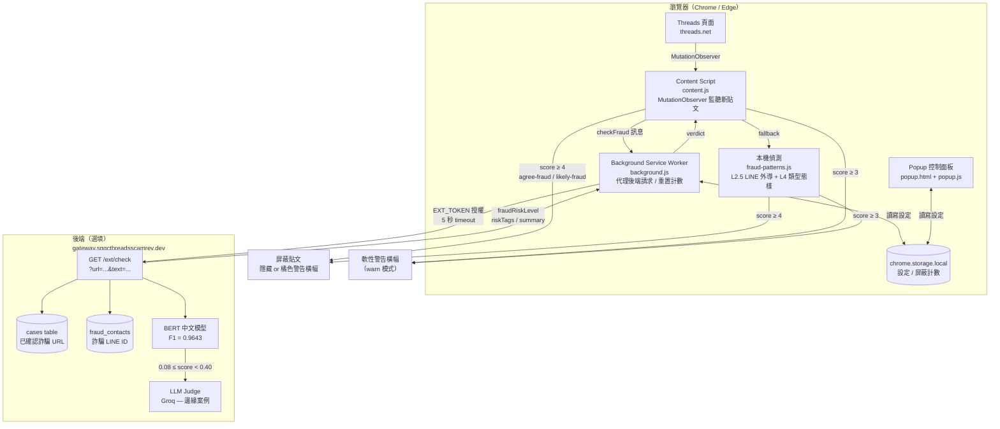

# anti-fraud-policy

Threads 防詐屏蔽擴充功能 — 台灣政府防詐協作計畫（Wistron Software × 數位部）。

自動識別並屏蔽 Threads 上的詐騙貼文（引導加 LINE 外導、投資話術、假徵才、交友詐騙等）。

---

## 架構總覽



### 偵測流程說明

1. **Content Script** 透過 `MutationObserver` 監聽 Threads SPA 的新貼文，取出文字與貼文網址。
2. **有設定後端**：訊息送至 Background SW → 向 `/ext/check` 查詢詐騙資料庫，得到後端判決即直接處理，不再跑本機規則。
3. **無後端 / 後端無結論**：退回本機 `fraud-patterns.js`：
   - **L2.5 LINE 外導**（最高信心，直接命中）：偵測 `lin.ee`/`line.me` 直連、動詞＋LINE/賴、`@帳號` 格式等 7 種向量，排除 LINE Pay 與反詐警示語境。
   - **L4 類型態樣**（15 組，all-must-match）：假出售、投資詐騙（含飆股 / N 年經驗變體）、假徵才、假代工、假贈品 / 抽獎 / 虛寶（含數量型）、交友詐騙（5 種固定台詞）。
   - **補充話術**（4 組可累積）：穩定獲利、假兼職、緊迫感、假見證。
4. **判決**：`score ≥ 4` → 屏蔽；`score ≥ 3` → 軟性警告。

---

## 專案結構

```
browser-extension/
├── manifest.json          # Chrome MV3 設定
├── content.js             # 注入 Threads 頁面，掃描並處理詐騙貼文
├── fraud-patterns.js      # 本機偵測規則（L2.5 + L4，移植自 gateway_reviewer/db.py）
├── background.js          # Service Worker，代理後端 API、換頁重置計數
├── popup.html / popup.js  # 控制面板（開關、屏蔽方式、後端設定）
└── icons/                 # 圖示（16 / 48 / 128 px）
```

---

## 功能對比

| 功能 | 無後端（本機） | 有後端 |
|------|:-:|:-:|
| LINE 外導偵測（L2.5） | ✅ | ✅ |
| 類型話術偵測（L4，15 組） | ✅ | ✅ |
| 補充話術累積 | ✅ | ✅ |
| 已確認詐騙 URL 比對 | — | ✅ |
| 已知詐騙 LINE 帳號比對 | — | ✅ |
| BERT 語意模型（F1=0.9643） | — | ✅ |
| LLM Judge（邊緣案例） | — | ✅ |
| 動態關鍵字更新 | — | ✅ |

---

## 安裝

見 [browser-extension/INSTALL.md](browser-extension/INSTALL.md)。

---

## 確認擴充功能有在運作

- 點擴充功能圖示，Popup 大數字顯示**本頁已屏蔽數**（重整歸零）。
- 切換至「⚠️ 顯示警告」模式，可看到偵測到的貼文頂部出現橘色警告條，並顯示命中的詐騙類型。
- 開啟 DevTools → Console，可在 `content.js` 加入 `console.log` 觀察每篇貼文的分數細節。

---

## 隱私

- **未設定後端時**：偵測全在本機執行，不上傳任何資料。
- **設定後端後**：公開貼文的文字（最多 500 字）與貼文網址會上傳至你設定的後端進行比對。
- 僅讀取頁面已公開顯示的貼文文字，不蒐集個人資訊。

完整條款見 [privacy.md](privacy.md)。
